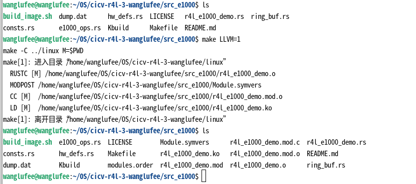
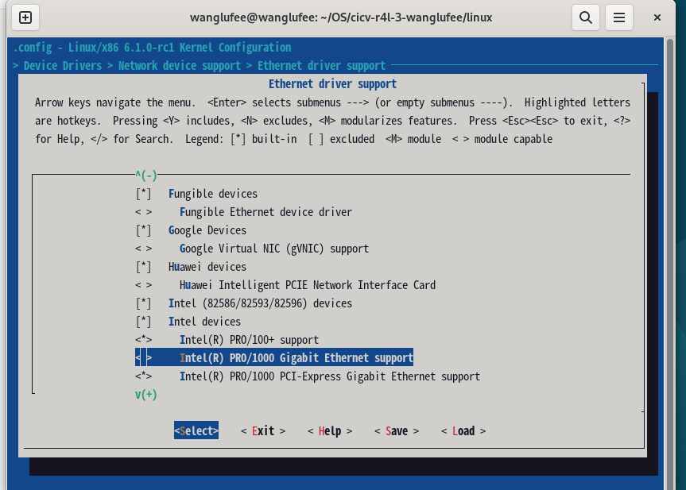
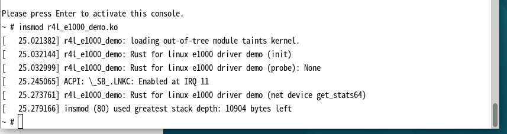
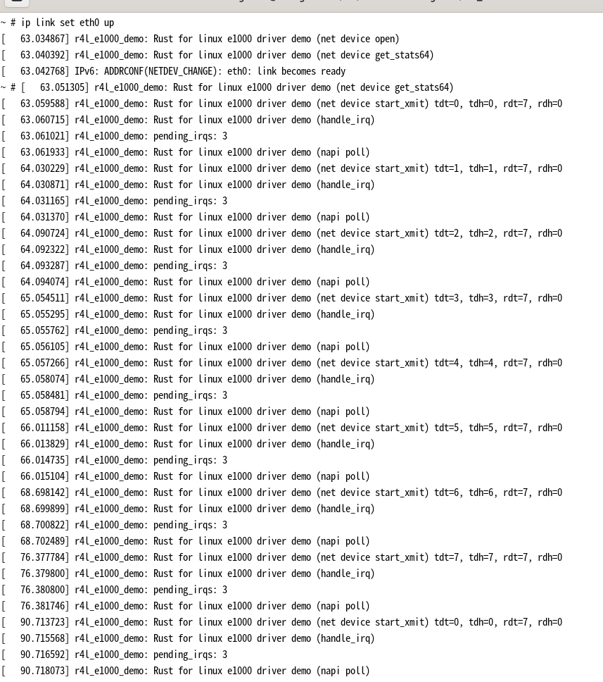
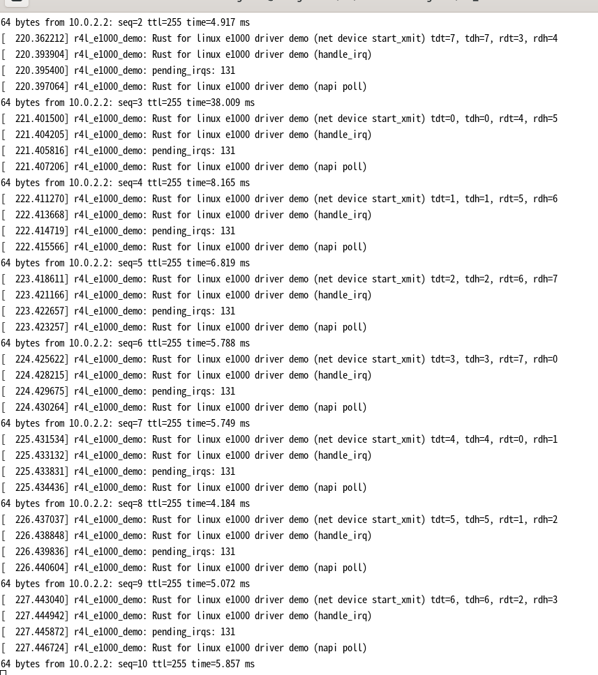
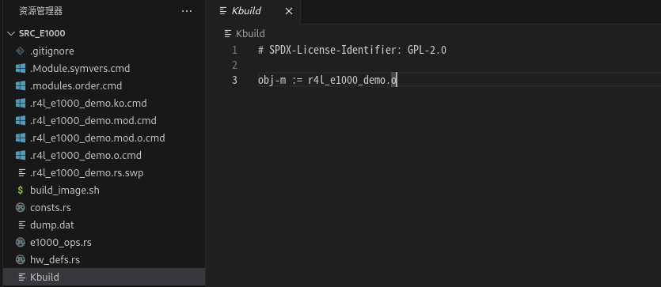

> 实验过程

1.首先编译模块，生成 r4l_e1000_demo.ko 文件

2.重新编译内核，编译时禁用调默认的e1000网卡

3.启动 qemu 将模块插入内核中，并对网卡进行配置。

4.进行 ping 命令，进行检验。

> 问题解答

1.可以编译成内核模块是在 Kbuild 文件中定义的。

其中 `-m` 表明需要编译为一个模块。

2.这个模块在编译的开始首先进入了 linux 目录，然后开始编译，完成之后退出了 linux 目录，编译完成之后，可以通过 insmod 命令来动态加载到内核中进行使用。
