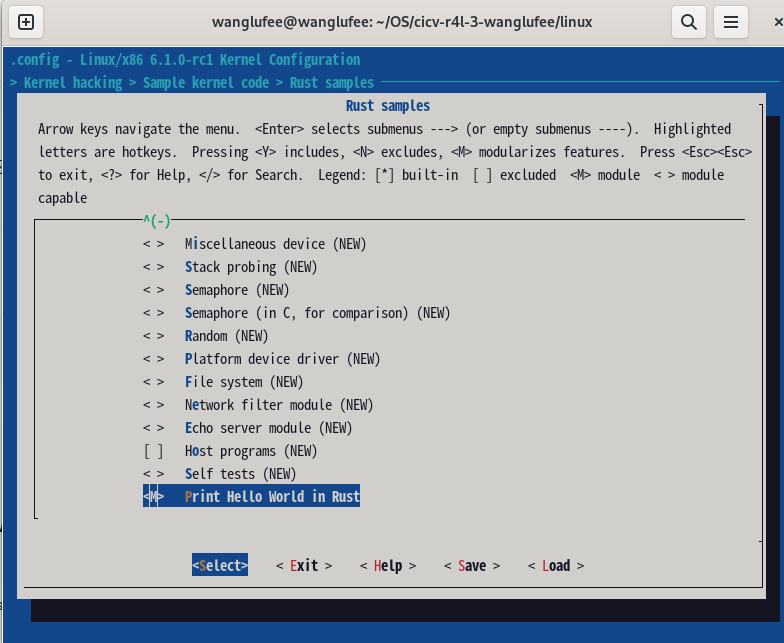
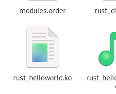

首先将 rust 模块代码复制过去，然后开始更改 kconfig 和 Makefile 文件，添加配置项。

kconfig文件添加
```bash
config SAMPLE_RUST_HELLO
	tristate "Print Hello World in Rust"   # 设置为三态选项  n y m
	help
	  This build a module which can print hello world.
```

Makefile文件添加
```bash
obj-$(CONFIG_SAMPLE_RUST_HELLO)         += rust_helloworld.o
```
通过 rust_helloworld.rs 文件在生成

配置选项



编译生成 .ko 文件



在系统中进行安装模块

