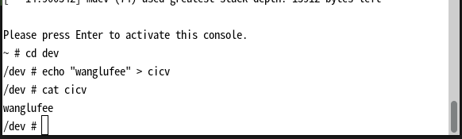
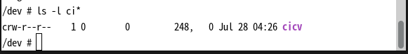

1.dev/cicv 是在build_image.sh中进行创建的
```bash
echo "mknod /dev/cicv c 248 0" >> etc/init.d/rcS
```
主设备号是 248 次设备号是 0
```bash
chrdev::Registration::new_pinned(name, 0, module)?;
```
通过这行语句去创建，然后注册，并与驱动关联的。

> 实验部分

代码实现
```rust
    fn write(_this: &Self,_file: &file::File,_reader: &mut impl kernel::io_buffer::IoBufferReader,_offset:u64,) -> Result<usize> {
        let mut vec = _this.inner.lock();
        let len = if _reader.len() < vec.len() {
            _reader.len()
        } else {
            vec.len()
        };
        _reader.read_slice(&mut vec[..len])?;
        Ok(len)
    }

    fn read(_this: &Self,_file: &file::File,_writer: &mut impl kernel::io_buffer::IoBufferWriter,_offset:u64,) -> Result<usize> {
        let offset = _offset as usize;
        let vec = _this.inner.lock();
        let len = if _writer.len() < vec.len().saturating_sub(offset) {
            _writer.len()
        } else {
            vec.len().saturating_sub(offset)
        };
        _writer.write_slice(&vec[..len])?;
        Ok(len)
    }
```


